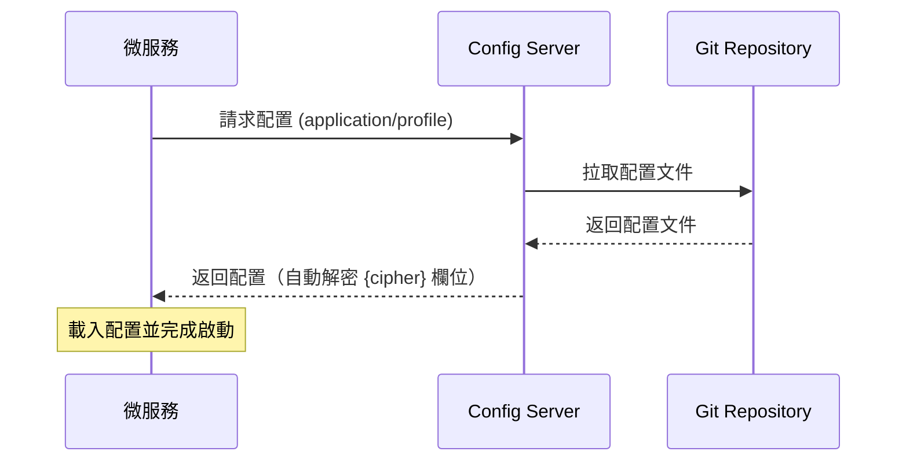
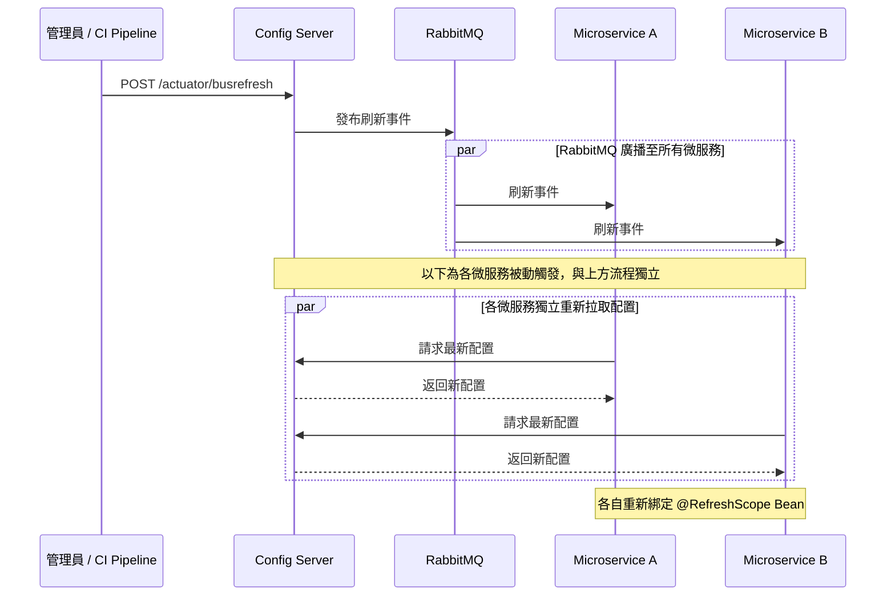

# Config Service


## 概述

採用 Spring Cloud Config Server 作為微服務架構的集中式配置中心。主要特點：

- **Git 版本控制**：配置檔存放於 Git 儲存庫，支援變更歷史追蹤與分支管理
- **環境隔離**：透過 `{application}-{profile}.yml` 命名規則區分 dev、prod 等環境
- **敏感資訊加密**：整合 JCE 對稱加密，保護資料庫密碼、API Key 等機敏資料
- **零停機更新**：透過 Spring Cloud Bus + RabbitMQ 動態刷新配置，無需重啟服務
- **安全存取**：Spring Security Basic Auth 保護所有配置端點

## 技術堆疊

- **核心框架**：Java 21 / Spring Boot 3.4.3
- **配置中心**：Spring Cloud Config Server 2024.0.0
- **事件匯流排**：Spring Cloud Bus（AMQP / RabbitMQ）
- **安全機制**：Spring Security（Basic Auth）/ JCE 對稱加密
- **建構工具**：Gradle 8.12.1（Kotlin DSL）
- **容器化部署**：Docker（Alpine JRE 21）

## 系統架構

### 階段 1：微服務啟動的配置初始化



### 階段 2：配置動態更新

管理員將配置變更 Push 至 Git Repository 後，觸發刷新流程：



## 核心專案配置

主要配置檔為 `src/main/resources/application.yml`，依賴與建構設定見 `build.gradle.kts`。

### Git 配置檔案結構

配置檔存放於 Git 儲存庫的 `configs/` 目錄，命名規則為 `{application}-{profile}.yml`：

```
configs/
└── gatewayservice-prod.yml # Gateway 生產環境配置
```

配置取得端點：`GET /{application}/{profile}[/{label}]`

```bash
# 取得 gatewayservice 的 prod 配置
curl -u <username>:<password> http://localhost:8888/gatewayservice/prod
```

## 安全加密指南

使用 JCE 對稱加密保護敏感資訊。Config Server 透過 `ENCRYPT_KEY` 環境變數設定主密鑰，提供 `/encrypt` 與 `/decrypt` 端點。

### 加密操作流程

**1. 驗證加密環境**

```bash
curl -u <username>:<password> http://localhost:8888/encrypt/status
# 預期回應：{"status":"OK"}
```

**2. 加密明文**

```bash
curl -u <username>:<password> -X POST http://localhost:8888/encrypt -d "MyDatabasePassword"
# 回傳密文：AQBkNpQqxT8vZ3mK1lO...
```

**3. 在 Git 配置檔中使用密文**

```yaml
spring:
  datasource:
    password: '{cipher}AQBkNpQqxT8vZ3mK1lO...'
```

**4. 驗證解密**

```bash
curl -u <username>:<password> -X POST http://localhost:8888/decrypt -d "AQBkNpQqxT8vZ3mK1lO..."
# 回傳明文：MyDatabasePassword
```

微服務向 Config Server 請求配置時，`{cipher}` 前綴的欄位會在 Config Server 端自動解密後返回明文，客戶端無需處理解密邏輯。

## 零停機刷新流程

透過 Spring Cloud Bus + RabbitMQ，配置變更後無需重啟任何微服務。

### 操作步驟

1. 將配置變更 Push 至 Git Repository
2. 向 Config Server 發送刷新請求：

```bash
# 刷新所有微服務
curl -u <username>:<password> -X POST http://localhost:8888/actuator/busrefresh

# 刷新特定服務
curl -u <username>:<password> -X POST http://localhost:8888/actuator/busrefresh/gatewayservice:**
```

### 客戶端前提條件

客戶端微服務必須使用 `spring.config.import`（非舊式 bootstrap.yml）接入 Config Server：

```kotlin
// build.gradle.kts
dependencies {
    implementation("org.springframework.cloud:spring-cloud-starter-config")
    implementation("org.springframework.cloud:spring-cloud-starter-bus-amqp")  // 動態刷新需要
    implementation("org.springframework.boot:spring-boot-starter-actuator")
}
```

```yaml
# application.yml
spring:
  application:
    name: gatewayservice                                  # 對應 Git 配置檔的 {application}
  config:
    import: "configserver:http://configservice:8888"      # Config Server 位址
  cloud:
    config:
      username: ${SPRING_CLOUD_CONFIG_USERNAME}
      password: ${SPRING_CLOUD_CONFIG_PASSWORD}
      fail-fast: true                                     # 連線失敗時拒絕啟動
    bus:
      enabled: true                                       # 啟用 Bus 事件監聽
  rabbitmq:
    host: ${RABBITMQ_HOST}
    port: ${RABBITMQ_PORT:5672}
    username: ${RABBITMQ_USER}
    password: ${RABBITMQ_PASS}
```

需要動態刷新的 Bean 標註 `@RefreshScope`，配置變更後會自動重新綁定，無需重啟服務。

## Docker Compose 部署

部署相關檔案位於 `docs/docker/` 目錄：

| 檔案                   | 說明                             |
|----------------------|--------------------------------|
| `docker-compose.yml` | 服務編排（Config Server + RabbitMQ） |
| `.env.example`       | 環境變數範本                         |
| `Dockerfile`         | Config Server 容器映像定義           |

```bash
# 複製範本並填入實際值
cp docs/docker/.env.example docs/docker/.env

# 建構 JAR
./gradlew bootJar

# 啟動服務
docker compose -f docs/docker/docker-compose.yml up -d
```

### 客戶端微服務整合

客戶端微服務透過 Docker Network 內部通訊，使用服務名稱（`configservice`、`rabbitmq`）作為主機位址。整合時需於客戶端設定以下環境變數：

```yaml
environment:
  - SPRING_PROFILES_ACTIVE=prod
  - SPRING_CONFIG_IMPORT=configserver:http://configservice:8888
  - SPRING_CLOUD_CONFIG_USERNAME=${SECURITY_USERNAME}
  - SPRING_CLOUD_CONFIG_PASSWORD=${SECURITY_PASSWORD}
  - SPRING_RABBITMQ_HOST=rabbitmq
```

## 環境變數

| 變數                    | 預設值                                         | 說明                        |
|-----------------------|---------------------------------------------|---------------------------|
| `SERVER_PORT`         | `8888`                                      | 服務埠號                      |
| `SECURITY_USERNAME`   | 必填                                          | Basic Auth 帳號             |
| `SECURITY_PASSWORD`   | 必填                                          | Basic Auth 密碼             |
| `CONFIG_GIT_URI`      | `https://github.com/AceNexus/configservice` | 配置檔 Git 儲存庫位址             |
| `CONFIG_GIT_USERNAME` | -                                           | Git 帳號（私有儲存庫需提供）          |
| `CONFIG_GIT_PASSWORD` | -                                           | Git Personal Access Token |
| `ENCRYPT_KEY`         | 必填                                          | JCE 對稱加密主密鑰               |
| `RABBITMQ_HOST`       | `localhost`                                 | RabbitMQ 主機位址             |
| `RABBITMQ_PORT`       | `5672`                                      | RabbitMQ 連接埠              |
| `RABBITMQ_USER`       | 必填                                          | RabbitMQ 帳號               |
| `RABBITMQ_PASS`       | 必填                                          | RabbitMQ 密碼               |

## API 端點

| 端點                                   | 方法   | 說明         |
|--------------------------------------|------|------------|
| `/{application}/{profile}`           | GET  | 取得配置       |
| `/encrypt`                           | POST | 加密明文       |
| `/decrypt`                           | POST | 解密密文       |
| `/encrypt/status`                    | GET  | 加密環境狀態     |
| `/actuator/health`                   | GET  | 健康檢查       |
| `/actuator/busrefresh`               | POST | 觸發全域配置刷新   |
| `/actuator/busrefresh/{destination}` | POST | 觸發特定服務配置刷新 |

## 常用運維 Docker 指令

| 指令                                                     | 說明                    |
|--------------------------------------------------------|-----------------------|
| `docker compose up -d`                                 | 啟動所有服務                |
| `docker compose down`                                  | 停止並移除所有容器             |
| `docker compose logs -f configservice`                 | 即時查看 Config Server 日誌 |
| `docker compose restart configservice`                 | 重啟 Config Server      |
| `docker compose ps`                                    | 查看所有容器狀態              |
| `docker exec -it rabbitmq rabbitmq-diagnostics status` | 檢查 RabbitMQ 狀態        |
| `docker compose build --no-cache configservice`        | 重新建構映像（不使用快取）         |

## 參考資源

- [Spring Cloud Config 官方文件](https://docs.spring.io/spring-cloud-config/docs/current/reference/html/)
- [Spring Cloud Bus 官方文件](https://docs.spring.io/spring-cloud-bus/docs/current/reference/html/)
- [RabbitMQ 管理指南](https://www.rabbitmq.com/management.html)
