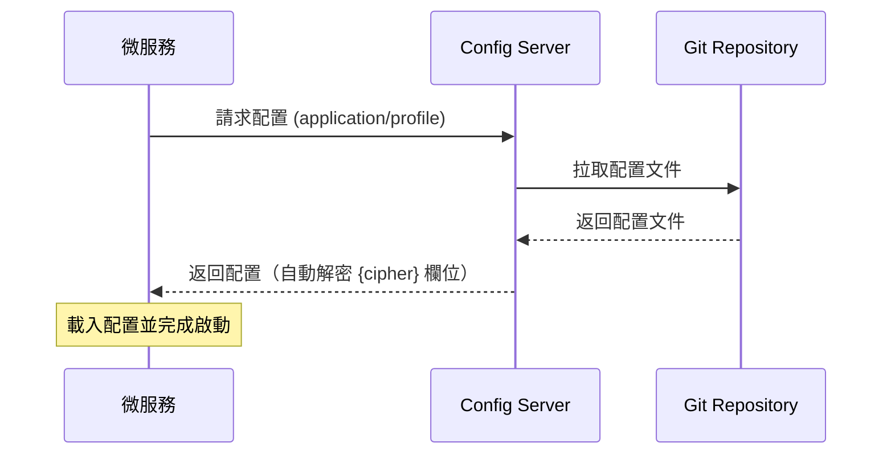
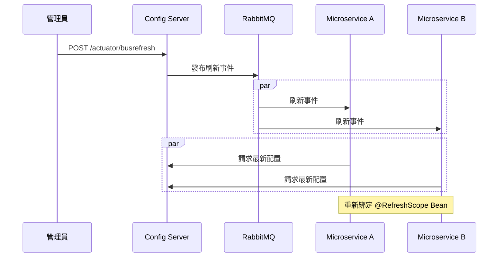

# Config Service


微服務生態系的集中式配置中心，基於 Spring Cloud Config Server。從 Git 儲存庫讀取配置檔，透過 REST API 提供給各微服務，支援
JCE 加密與 Spring Cloud Bus 動態刷新。

## 快速開始

### 前置需求

- Java 21
- Docker Desktop

### 使用 IntelliJ IDEA

1. 啟動本地 RabbitMQ（首次執行即可，之後會自動隨 Docker Desktop 啟動）：
   ```bash
   docker run -d --name rabbitmq --restart unless-stopped -p 5672:5672 -p 15672:15672 rabbitmq:3-management-alpine
   ```
2. `File` → `Open` → 選擇專案根目錄，等待 Gradle 同步完成
3. `Run` → `Edit Configurations` → `ConfigserviceApplication` → `Environment variables`
4. 輸入框貼上：`SECURITY_USERNAME=admin;SECURITY_PASSWORD=password;ENCRYPT_KEY=my-secret-key;RABBITMQ_USER=guest;RABBITMQ_PASS=guest`

   | 變數 | 開發用值 |
   |---|---|
   | `SECURITY_USERNAME` | `admin` |
   | `SECURITY_PASSWORD` | `password` |
   | `ENCRYPT_KEY` | `my-secret-key` |
   | `RABBITMQ_USER` | `guest` |
   | `RABBITMQ_PASS` | `guest` |

5. 點擊 `ConfigserviceApplication` 旁的 ▶ 啟動
6. 開啟 http://localhost:8888/actuator/health 確認回傳 `{"status":"UP"}`


## 系統架構

### 配置初始化

微服務啟動時向 Config Server 請求配置，Config Server 從 Git 拉取後回傳（自動解密 `{cipher}` 欄位）：



### 動態刷新

配置變更 Push 至 Git 後，透過 `POST /actuator/busrefresh` 觸發 RabbitMQ 廣播，所有微服務自動拉取新配置，無需重啟：



### 配置檔結構

配置檔存放於 Git 儲存庫的 `configs/` 目錄，命名規則為 `{application}-{profile}.yml`：

```
configs/
└── gatewayservice-prod.yml    # Gateway 生產環境配置
```

## API 端點

| 端點                                   | 方法   | 說明         | 認證  |
|--------------------------------------|------|------------|-----|
| `/{application}/{profile}`           | GET  | 取得配置       | 需要  |
| `/encrypt`                           | POST | 加密明文       | 需要  |
| `/decrypt`                           | POST | 解密密文       | 需要  |
| `/encrypt/status`                    | GET  | 加密環境狀態     | 需要  |
| `/actuator/health`                   | GET  | 健康檢查       | 不需要 |
| `/actuator/busrefresh`               | POST | 觸發全域配置刷新   | 需要  |
| `/actuator/busrefresh/{destination}` | POST | 觸發特定服務配置刷新 | 需要  |

需認證的端點皆使用 HTTP Basic Auth（`SECURITY_USERNAME` / `SECURITY_PASSWORD`）。

## 環境變數

| 變數                    | 預設值                                         | 說明                        |
|-----------------------|---------------------------------------------|---------------------------|
| `SECURITY_USERNAME`   | 必填                                          | Basic Auth 帳號             |
| `SECURITY_PASSWORD`   | 必填                                          | Basic Auth 密碼             |
| `ENCRYPT_KEY`         | 必填                                          | JCE 對稱加密主密鑰               |
| `RABBITMQ_USER`       | 必填                                          | RabbitMQ 帳號               |
| `RABBITMQ_PASS`       | 必填                                          | RabbitMQ 密碼               |
| `RABBITMQ_HOST`       | `localhost`                                 | RabbitMQ 主機位址             |
| `RABBITMQ_PORT`       | `5672`                                      | RabbitMQ 連接埠              |
| `SERVER_PORT`         | `8888`                                      | 服務埠號                      |
| `CONFIG_GIT_URI`      | `https://github.com/AceNexus/configservice` | 配置檔 Git 儲存庫位址             |
| `CONFIG_GIT_USERNAME` | -                                           | Git 帳號（私有儲存庫需提供）          |
| `CONFIG_GIT_PASSWORD` | -                                           | Git Personal Access Token |

## 操作指南

### 加密敏感資訊

```bash
# 1. 確認加密環境正常
curl -u <username>:<password> http://localhost:8888/encrypt/status
# {"status":"OK"}

# 2. 加密
curl -u <username>:<password> -X POST http://localhost:8888/encrypt -d "MyDatabasePassword"
# AQBkNpQqxT8vZ3mK1lO...

# 3. 寫入配置檔
# spring:
#   datasource:
#     password: '{cipher}AQBkNpQqxT8vZ3mK1lO...'

# 4. 驗證解密
curl -u <username>:<password> -X POST http://localhost:8888/decrypt -d "AQBkNpQqxT8vZ3mK1lO..."
# MyDatabasePassword
```

微服務請求配置時，`{cipher}` 前綴的欄位會在 Config Server 端自動解密後返回明文。

### 動態刷新配置

```bash
# 1. 將配置變更 Push 至 Git

# 2. 觸發刷新
curl -u <username>:<password> -X POST http://localhost:8888/actuator/busrefresh

# 刷新特定服務
curl -u <username>:<password> -X POST http://localhost:8888/actuator/busrefresh/gatewayservice:**
```

### 客戶端微服務整合

客戶端需加入以下依賴與配置：

```kotlin
// build.gradle.kts
dependencies {
    implementation("org.springframework.cloud:spring-cloud-starter-config")
    implementation("org.springframework.cloud:spring-cloud-starter-bus-amqp")
    implementation("org.springframework.boot:spring-boot-starter-actuator")
}
```

```yaml
# application.yml
spring:
  application:
    name: gatewayservice                                  # 對應 configs/ 中的 {application}
  config:
    import: "configserver:http://configservice:8888"
  cloud:
    config:
      username: ${SPRING_CLOUD_CONFIG_USERNAME}
      password: ${SPRING_CLOUD_CONFIG_PASSWORD}
      fail-fast: true
    bus:
      enabled: true
  rabbitmq:
    host: ${RABBITMQ_HOST}
    port: ${RABBITMQ_PORT:5672}
    username: ${RABBITMQ_USER}
    password: ${RABBITMQ_PASS}
```

Docker Compose 整合時，使用服務名稱作為主機位址：

```yaml
environment:
  - SPRING_PROFILES_ACTIVE=prod
  - SPRING_CONFIG_IMPORT=configserver:http://configservice:8888
  - SPRING_CLOUD_CONFIG_USERNAME=${SECURITY_USERNAME}
  - SPRING_CLOUD_CONFIG_PASSWORD=${SECURITY_PASSWORD}
  - SPRING_RABBITMQ_HOST=rabbitmq
```

需要動態刷新的 Bean 標註 `@RefreshScope`，配置變更後會自動重新綁定。

## 部署

以下指令在**部署目標主機**上執行，需已安裝 Docker 與 Docker Compose。Windows 和 Linux 流程一致。

### 部署目錄結構

將以下四個檔案放在同一個目錄下：

```
/opt/configservice/              # Linux 範例路徑（Windows 可自訂）
├── configservice.jar            # 編譯產出
├── Dockerfile                   # 來源：docs/docker/Dockerfile
├── docker-compose.yml           # 來源：docs/docker/docker-compose.yml
└── .env                         # 來源：docs/docker/.env.example（填入實際值）
```

### 首次部署

1. 在專案開發機編譯 JAR：
   ```bash
   ./gradlew bootJar
   ```
2. 將 `build/libs/configservice.jar`、`docs/docker/Dockerfile`、`docs/docker/docker-compose.yml`、`docs/docker/.dockerignore`、`docs/docker/.env.example` 複製到部署主機的同一目錄
3. 將 `.env.example` 改名為 `.env`，填入實際的帳號密碼與加密金鑰
4. 在該目錄下啟動：
   ```bash
   docker compose up -d
   ```

### 更新版本

1. 在開發機重新編譯 JAR
2. 將新的 `configservice.jar` 複製到部署目錄，覆蓋舊檔
3. 重新建構並啟動：
   ```bash
   docker compose up -d --build
   ```

### 驗證

部署完成後確認服務狀態（`<username>` / `<password>` 為 `.env` 中設定的值）：

```bash
docker compose ps
curl http://localhost:8888/actuator/health
curl -u <username>:<password> http://localhost:8888/gatewayservice/prod
```

### 常用維運指令

| 指令                                            | 說明        |
|-----------------------------------------------|-----------|
| `docker compose logs -f configservice`        | 即時查看日誌    |
| `docker compose restart configservice`        | 重啟服務      |
| `docker compose down`                         | 停止並移除所有容器 |
| `docker compose build --no-cache`             | 重新建構映像    |

## 版本管理

本專案採用 [Semantic Versioning](https://semver.org/)，以 **Git Tag 作為唯一版本來源**。`build.gradle.kts` 建構時自動讀取最近的
Tag 作為版本號，無 Tag 則為 `0.0.1-SNAPSHOT`。

### 版號規則

| 版號位置  | 何時遞增         | 範例                  |
|-------|--------------|---------------------|
| MAJOR | 重大架構變更、技術棧升級 | `v1.0.0` → `v2.0.0` |
| MINOR | 新增功能、配置結構調整  | `v1.0.0` → `v1.1.0` |
| PATCH | Bug 修復、小幅調整  | `v1.0.0` → `v1.0.1` |

### 發版流程

```bash
./gradlew build                    # 1. 確認測試通過
git add <files>                    # 2. Commit 變更
git commit -m "[feat] 功能描述"
git tag v1.0.0                     # 3. 打 Tag 定版
git push && git push --tags        # 4. Push
```

然後到伺服器執行[更新版本](#更新版本)即可。

### Commit 訊息格式

```
[類型] 中文描述
```

| 類型         | 說明        |
|------------|-----------|
| `feat`     | 新增功能      |
| `fix`      | 修復 Bug    |
| `refactor` | 重構（不影響功能） |
| `docs`     | 文件更新      |
| `test`     | 測試相關      |
| `config`   | 配置檔變更     |

## 參考資源

- [Spring Cloud Config 官方文件](https://docs.spring.io/spring-cloud-config/docs/current/reference/html/)
- [Spring Cloud Bus 官方文件](https://docs.spring.io/spring-cloud-bus/docs/current/reference/html/)
- [RabbitMQ 管理指南](https://www.rabbitmq.com/management.html)
